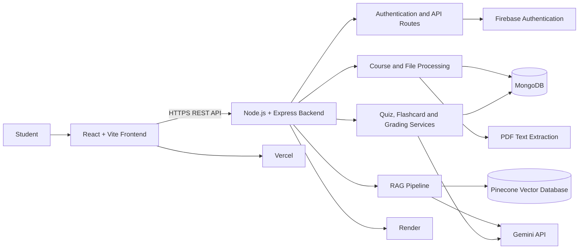

# courseWhiz link:https://course-whiz-peach.vercel.app/login
### AI-Powered Study Companion & Quiz Engine
CourseWhiz is a full-stack AI-powered learning platform that helps students transform their own study materials into interactive learning experiences. Users can upload PDFs or notes, organize them into courses, ask questions through an AI study assistant, generate quizzes and flashcards, and evaluate subjective answers using content-grounded AI.
The platform uses Retrieval-Augmented Generation (RAG) so that responses and learning content are based on the user's uploaded study material rather than unrestricted general knowledge.

## Features
### 1. Course Creation
- Create and manage personal courses.
- Upload PDFs and study materials.
- Organize learning content by subject or topic.
- Extract and process text from uploaded documents.
### 2. AI Study Chat
- Ask questions about uploaded course material.
- Receive context-aware explanations.
- Retrieve relevant information from indexed study content.
- Reduce unsupported or unrelated AI responses through RAG-based retrieval.
### 3. AI Quiz Engine
- Generate quizzes from uploaded study material.
- Support objective and subjective question formats.
- Practice questions based on a selected course.
- Submit answers and review results.
### 4. AI Grading
- Evaluate subjective answers against the uploaded source material.
### 5. Flashcards
- Generate revision flashcards from course content.
- Support quick revision and concept recall.
### 6. Authentication
- Firebase-based user authentication.
- Protected application experience for registered users.
### 7. Learning Dashboard
- View courses and learning activities.
- Access chat, quizzes, flashcards, and course details from a centralized interface.
- Track learning activity and performance where supported by the application.
## System Architecture



### RAG Workflow
flowchart TD
    A[User uploads PDF or notes] --> B[Extract document text]
    B --> C[Split text into meaningful chunks]
    C --> D[Generate embeddings]
    D --> E[Store vectors in Pinecone]
    F --> [User asks a question] --> G[Generate query representation]
    G --> H[Search relevant chunks in Pinecone]
    H --> I[Build context from retrieved content]
    I --> J[Send context and question to Gemini]
    J --> K[Return grounded response to user]
## Technology Stack
### Frontend
- React
- Vite
- Tailwind CSS
- Axios
- JavaScript / JSX
### Backend
- Node.js
- Express.js
- Mongoose
- Multer
- PDF parsing utilities
- JWT utilities
- Axios
### AI and Data
- Google Gemini API
- Retrieval-Augmented Generation (RAG)
- Pinecone Vector Database
- MongoDB
### Authentication and Deployment
- Firebase Authentication
- Vercel for frontend deployment
- Render for backend deployment
- GitHub for source control
## Project Structure

```text
CourseWhiz/
├── client/
│   ├── public/
│   ├── src/
│   │   ├── assets/
│   │   ├── components/
│   │   ├── pages/
│   │   ├── App.jsx
│   │   ├── App.css
│   │   ├── firebase.js
│   │   ├── index.css
│   │   └── main.jsx
│   ├── .env
│   ├── package.json
│   ├── vite.config.js
│   └── README.md
│
├── server/
│   ├── config/
│   ├── controllers/
│   ├── models/
│   ├── routes/
│   ├── services/
│   ├── utils/
│   ├── index.js
│   ├── package.json
│   └── .env
│
├── .gitignore
└── README.md
```
## Getting Started
### Prerequisites

Install the following before running the project:
- Node.js 18 or later
- npm
- MongoDB database
- Google Gemini API key
- Pinecone account and index
- Firebase project

### 1. Clone the repository
```bash
git clone https://github.com/sudheermaddala76-sketch/CourseWhiz.git
cd CourseWhiz
```
### 2. Configure the backend
```bash
cd server
npm install
```
Create a `.env` file inside the `server` directory:
```env
GEMINI_API_KEY=your_gemini_api_key
PINECONE_API_KEY=your_pinecone_api_key
PINECONE_INDEX=your_pinecone_index_name
MONGODB_URI=your_mongodb_connection_string
JWT_SECRET=your_jwt_secret
PORT=3001
```
Start the backend:
```bash
npm start
```
For development:
```bash
npm run dev
```
### 3. Configure the frontend
Open a new terminal:
```bash
cd client
npm install
```
Create a `.env` file inside the `client` directory:
```env
VITE_FIREBASE_API_KEY=your_firebase_api_key
VITE_FIREBASE_AUTH_DOMAIN=your_firebase_auth_domain
VITE_FIREBASE_PROJECT_ID=your_firebase_project_id
VITE_FIREBASE_STORAGE_BUCKET=your_firebase_storage_bucket
VITE_FIREBASE_MESSAGING_SENDER_ID=your_firebase_sender_id
VITE_FIREBASE_APP_ID=your_firebase_app_id
VITE_API_URL=http://localhost:3001
```
Start the frontend:
```bash
npm run dev
```
The frontend will normally be available at:
```text
http://localhost:5173
```
## Environment Variable Security
Never commit `.env` files or expose secret credentials in GitHub.
Make sure `.gitignore` includes:
```gitignore
.env
.env.*
!.env.example
node_modules/
dist/
```
## How the Application Works

1. A student registers or logs in.
2. The student creates a course and uploads study material.
3. The backend extracts text from the uploaded document.
4. The content is processed and indexed for retrieval.
5. The student asks questions through AI Study Chat.
6. The RAG pipeline retrieves relevant content and sends it to Gemini.
7. Students can generate quizzes and flashcards from their material.
8. Subjective answers can be evaluated against the course content.
9. Students use the dashboard to continue learning and review performance.
## API Responsibilities
The backend provides REST APIs for:
- Authentication
- Course creation and retrieval
- PDF and document ingestion
- AI chat
- Quiz generation
- Flashcard generation
- Summary generation
- Diagram generation
- Subjective answer evaluation
- Course search and related learning operations

The exact endpoints may evolve as the project develops.
## Project Goals

CourseWhiz aims to:
- Make self-study more interactive.
- Reduce the time required to create practice material.
- Help students learn from their own notes.
- Provide source-grounded AI assistance.
- Support personalized revision through quizzes and flashcards.
- Combine document processing, vector search, and generative AI in one platform.
## Future Enhancements
Potential future improvements include:
- Spaced-repetition scheduling for flashcards.
- More detailed learning analytics.
- Multi-language study support.
- Voice-based AI study chat.
- Collaborative courses and study groups.
- Improved citation and source highlighting.
- Adaptive quizzes based on learner performance.
- Role-based access for educators and institutions.
## Author
**Sudheer Maddala**
B.Tech — Artificial Intelligence and Machine Learning
## Licens
This project is currently intended for educational and portfolio purposes. Add a formal license before distributing or commercializing the project.

